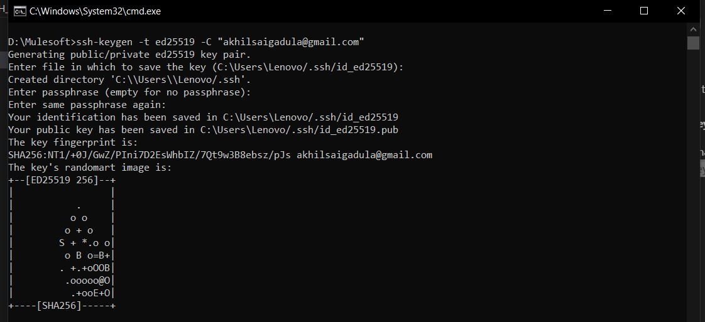
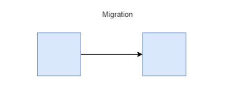
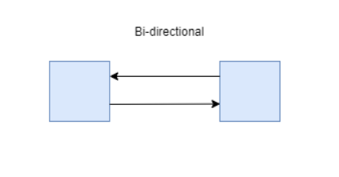
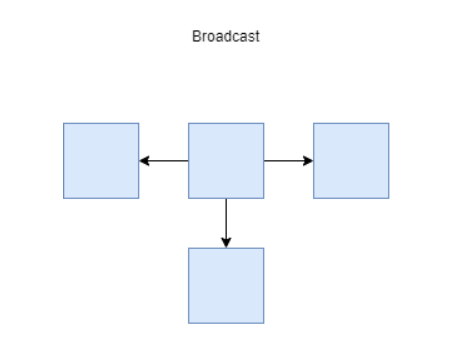
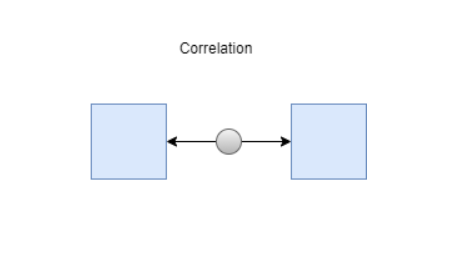
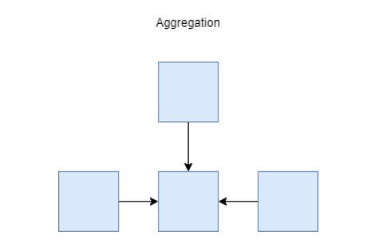
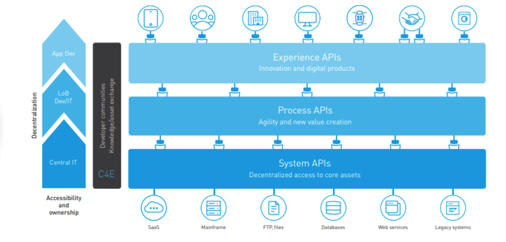

# GitHub

GitHub is a cloud-based platform where you can store, share, and work together with others to write code.

Storing your code in a "repository" on GitHub allows you to:

- Showcase or share your work.
- Track and manage changes to your code over time.
- Let others review your code, and make suggestions to improve it.

### Git

Git is a powerful tool for tracking changes in your code, coordinating work among multiple developers, and allowing you to revert to previous versions of your project if needed.

- Repository (Repo): A folder where Git tracks your project and its history. It contains all your project files and a hidden .git directory with metadata.

- Commit: A "snapshot" of your project's staged changes at a specific point in time. Each commit has a unique identifier (hash code) and a descriptive message.

- Branch: A lightweight, movable pointer to a commit. Branches allow you to isolate development work for a new feature or bug fix without affecting the main codebase (usually the main or master branch).

- Staging Area (Index): A middle ground between your working directory (where you edit files) and your repository. You use this area to prepare a set of changes to be included in the next commit. 

### Git Commands 

- `git status`: Shows the status of changes as untracked, modified, or staged.
- `git add <filename>`: Stages a specific file for the next commit. Use git add . to stage all modified files.
- `git commit -m "message"`: Records the staged snapshot permanently in the repository with a descriptive message.
- `git branch <branchname>`: Creates a new branch.

### Github Concepts

- Clone: To download a copy of a remote repository to your local machine.
- Push: To send your local commits to the remote repository on GitHub.
- Pull: To fetch the latest changes from the remote repository and merge them into your local branch.
- Pull Request (PR): A mechanism to propose changes from your branch to the main branch of a repository. It allows collaborators to review the code before merging

# SSH Setup

### What is SSH

An SSH key is an access credential in the SSH (Secure Shell) protocol used for secure remote login, file transfers, and automated access to network systems. They provide a more secure and convenient alternative to traditional passwords by using public-key cryptography (asymmetric encryption).

### How does SSH works

An SSH key always comes in a pair: a public key and a private key. 

Private Key: This key is analogous to a physical key and is kept secret and secure on the user's local machine. It must never be shared and is used to decrypt information sent by the server, proving the user's identity without ever being transmitted over the network. For added security, private keys are often encrypted with a passphrase.

Public Key: This key is like a lock and can be shared with any server you want to access. It is placed in an authorized_keys file on the remote server. The server uses the public key to encrypt a challenge message that only the corresponding private key can decrypt, thus verifying the client's identity.

### Setup

Here are the steps that need to be performed to setup SSH with Github.

#### Generating SSH keys

- Open Terminal/Command prompt
- Run `ssh-keygen -t ed25519 -C "akhilsaigadula@gmail.com"`

This creates a new SSH key, using the provided email as a label.

- Now we're prompted to "Enter a file in which to save the key", you can press Enter to accept the default file location.

- At the prompt, type a secure passphrase.

# Mulesoft

## Integration Patterns

### Migration Pattern

This pattern involves moving a large volume of data from a source system to a destination system at a specific point in time.Migrations can handle large volumes of data, process multiple records in batches, and in general, have low failure cases. This makes it a good option for backups and any transfer with lots of data.

### Bi-directional Pattern

This pattern combines two datasets in different systems so they behave as a single, consistent logical dataset, allowing changes in either system to be reflected in the other.

Bi-directional sync integration results in optimized performance which maintains data integrity across both synchronized systems. It adds and removes multiple systems that subspecialize in a domain as storage. This integration pattern is best when object representations need to be comprehensive and constant.

### Broadcast Pattern
Data flows from a single source system to one or many destination systems.This ensures that data across multiple systems stays up-to-date.
This happens on a near real-time or real-time basis. Put simply, it is one-way synchronization from one to many. One-way sync usually connotes a 1:1 relationship; while the broadcast pattern creates a 1: many relationship.

Broadcast patterns keep data up-to-date between several systems over time. A broadcast Salesforce integration pattern must be super reliable to prevent losing important data in transfer. And as they often have limited human oversight and are usually initiated in mission-critical systems by push notification or are scheduled, reliability becomes even more crucial.

### Correlation Pattern

 It only synchronizes data for items that already exist in both systems (the intersection of the datasets). 
 However, this only happens if the item transpires in both systems naturally.

 This pattern is needed in cases where two different systems want to share data, but only if they both have records that corroborate the same pieces of information or certain items. For example, retail stores might want to correlate customer data across different chains and partners but want to avoid any kind of privacy violations.

 

### Aggregation Pattern

This pattern involves querying data from multiple systems on demand, merging or processing that data, and presenting it as a single, consolidated response or report. The data is not replicated to a separate database.

Using a Salesforce integration template constructed on an aggregation pattern allows users to request multiple systems when needed and merge data sets to create or store reports into the format of choice. Aggregation contains a custom logic that can be adapted to merge and format data when needed, which can be easily extended to insert data into multiple systems.

## Fire-and-Forget (Asynchronous Communication)

The Fire-and-Forget pattern (also known as one-way messaging) is an asynchronous communication model where the sender sends a message or invokes a service without waiting for any confirmation or response.

## Request-Response (Synchronous Communication)

The Request-Response pattern is a synchronous communication model where the sender of a message waits for a reply from the receiver before proceeding with its own subsequent actions.

### HTTP/HTTPS

The client (browser, application, API gateway) opens a connection, sends a request line, headers, and an optional body, and then waits for the server to send back a status code, headers, and a response body.

### WebSockets

WebSockets upgrade the connection to a persistent, bi-directional channel, often used when continuous, low-latency communication is needed after the initial request.

## Monolith Architecture

A monolith or monolithic architecture is a traditional, unified approach to software design where an application is developed as a single, cohesive, and indivisible unit. 

In a monolithic application, all components—including the user interface, business logic, and data access layers—are part of a single, large codebase and are deployed together as a single package

## Microservices

Microservices is an architectural style that structures an application as a collection of small, independent, and loosely coupled services. 

Each service is self-contained, focusing on a single business capability, and can be developed, deployed, scaled, and maintained independently of the others. These services communicate with each other over a network, typically using lightweight protocols like HTTP/HTTPS with JSON or gRPC.

## API (Application Programming Interface)

An API (Application Programming Interface) is a set of rules, definitions, and protocols that allows different software applications to communicate with each other.

APIs are the building blocks of modern software and integration, enabling modularity and connectivity between services.

## Three Layered Architecture in Mulesoft 

The Three Layer Architecture is a specific implementation strategy used to organize APIs and integrations based on their function and proximity to source systems or user interfaces.

### System API Layer

This is the foundational layer. System APIs sit closest to the underlying systems of record (SoRs), such as databases (SAP, Oracle, Salesforce), legacy systems, and mainframes.

Example: A "Salesforce System API" that provides basic CRUD (Create, Read, Update, Delete) operations for Contact objects in Salesforce.

### Process API Layer

Process APIs consume data from multiple System APIs, orchestrate their interactions, apply business rules, and enrich the data as needed.

Example: A "Customer Onboarding Process API" that orchestrates calls to the "Salesforce System API," an "ERP System API" (for finance setup), and a "Notification System API" to ensure a new customer is provisioned correctly across all relevant systems.

### Experience API Layer

Experience APIs remix and format data specifically for the intended consumer (web portal, mobile app, partner application, etc.).

Example: A "Mobile App Experience API" that calls the "Customer Onboarding Process API" but formats the response specifically for the mobile UI, displaying a subset of data relevant to a phone screen.

